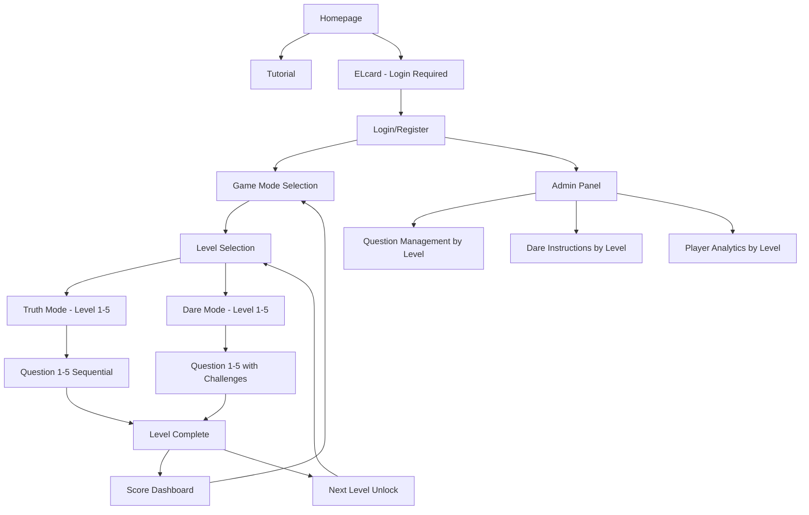

# Elphyta - Product Requirements Document

## 1. Product Overview
Elphyta adalah game matematika mobile yang berfokus pada soal teorema Pythagoras dengan desain 8-bit bergaya Mario Bros. Game ini menyediakan pembelajaran interaktif melalui dua mode permainan yang berbeda dengan sistem skor real-time.

Produk ini ditujukan untuk siswa dan penggemar matematika yang ingin belajar teorema Pythagoras dengan cara yang menyenangkan. Target pasar mencakup institusi pendidikan dan individu yang mencari platform pembelajaran matematika yang engaging.

## 2. Core Features

### 2.1 User Roles
| Role | Registration Method | Core Permissions |
|------|---------------------|------------------|
| Regular Player | Email registration | Dapat bermain game, melihat skor, mengakses tutorial |
| Admin (Game Master) | Admin invitation | Dapat mengelola soal, memberikan instruksi Dare mode, melihat statistik pemain |

### 2.2 Feature Module
Game Elphyta terdiri dari halaman-halaman utama berikut:
1. **Homepage**: hero section dengan branding 8-bit, navigation menu, dua kartu utama (ELcard dan Tutorial)
2. **Login/Register page**: form autentikasi pengguna, opsi registrasi baru
3. **Tutorial page**: penjelasan cara bermain, contoh soal teorema Pythagoras
4. **Game Mode Selection page**: pilihan mode Truth dan Dare, statistik pemain
5. **Level Selection page**: pilihan 5 level kesulitan untuk mode yang dipilih, progress tracking
6. **Truth Game page**: soal ABCD berurutan per level, timer, sistem skor progresif
7. **Dare Game page**: instruksi game master, soal ABCD berurutan dengan tantangan tambahan
8. **Level Progress page**: tracking kemajuan dalam level, unlock status level berikutnya
9. **Score Dashboard page**: leaderboard, riwayat permainan, statistik personal per level
10. **Admin Panel page**: manajemen soal per level, kontrol Dare mode, analitik pemain

### 2.3 Page Details
| Page Name | Module Name | Feature description |
|-----------|-------------|---------------------|
| Homepage | Hero Section | Display 8-bit Mario Bros style branding dengan animasi pixel art |
| Homepage | Navigation Menu | Menu responsif dengan ikon 8-bit untuk navigasi utama |
| Homepage | ELcard | Kartu interaktif untuk memulai permainan (memerlukan login) |
| Homepage | Tutorial Card | Kartu akses tutorial tanpa perlu login |
| Login/Register | Authentication Form | Form login dengan validasi, opsi "Remember Me", link registrasi |
| Login/Register | Registration Form | Form pendaftaran dengan email, password, konfirmasi password |
| Tutorial | Game Instructions | Penjelasan lengkap cara bermain kedua mode game |
| Tutorial | Pythagorean Examples | Contoh soal teorema Pythagoras dengan solusi step-by-step |
| Tutorial | Controls Guide | Panduan kontrol game dengan visual 8-bit |
| Game Mode Selection | Mode Selection | Pilihan antara Truth dan Dare mode dengan preview |
| Game Mode Selection | Player Stats | Statistik personal: total games, best score, average time |
| Level Selection | Level Grid | Grid 5 level kesulitan dengan status unlock dan progress |
| Level Selection | Level Preview | Preview tingkat kesulitan dan jumlah soal per level |
| Level Selection | Progress Tracker | Visual progress bar untuk setiap level yang telah dimainkan |
| Truth Game | Question Display | Tampilan soal teorema Pythagoras dengan pilihan ABCD, nomor soal (1-5) |
| Truth Game | Timer System | Countdown timer dengan visual 8-bit, tracking waktu penyelesaian |
| Truth Game | Score Calculator | Kalkulasi skor berdasarkan kecepatan dan akurasi jawaban |
| Truth Game | Level Progress | Progress bar menunjukkan soal ke berapa dari 5 soal dalam level |
| Truth Game | Sequential Flow | Sistem navigasi berurutan dari soal 1-5, tidak bisa skip |
| Dare Game | Game Master Instructions | Display instruksi khusus dari admin sebelum soal |
| Dare Game | Challenge Mechanics | Implementasi tantangan tambahan sesuai instruksi game master |
| Dare Game | ABCD Questions | Soal teorema Pythagoras dengan elemen tantangan, nomor soal (1-5) |
| Dare Game | Level Progress | Progress bar menunjukkan soal ke berapa dari 5 soal dalam level |
| Dare Game | Sequential Flow | Sistem navigasi berurutan dari soal 1-5 dengan tantangan per soal |
| Level Progress | Level Completion | Tracking penyelesaian 5 soal per level, unlock level berikutnya |
| Level Progress | Achievement System | Badge dan reward untuk menyelesaikan level tertentu |
| Level Progress | Level Statistics | Statistik performa per level: waktu, akurasi, skor total |
| Score Dashboard | Leaderboard | Ranking pemain berdasarkan skor tertinggi |
| Score Dashboard | Game History | Riwayat permainan dengan detail waktu dan skor |
| Score Dashboard | Personal Analytics | Grafik progress dan statistik pembelajaran |
| Admin Panel | Question Management | CRUD operations untuk soal teorema Pythagoras |
| Admin Panel | Dare Instructions | Interface untuk membuat dan mengelola instruksi Dare mode |
| Admin Panel | Player Analytics | Dashboard analitik performa dan engagement pemain |

## 3. Core Process

**Regular Player Flow:**
Pemain mengakses homepage → memilih Tutorial untuk belajar atau ELcard untuk bermain → login/register jika belum → memilih mode Truth atau Dare → memilih level kesulitan (1-5) → menyelesaikan 5 soal berurutan dalam level → melihat hasil level → unlock level berikutnya jika berhasil → dapat melanjutkan ke level berikutnya atau melihat dashboard skor.

**Admin Flow:**
Admin login → akses admin panel → mengelola bank soal teorema Pythagoras per level → membuat instruksi untuk Dare mode per level → memantau statistik dan performa pemain per level → melakukan moderasi konten.

## 4. User Interface Design

### 4.1 Design Style
- **Primary Colors**: #FF6B35 (Mario red), #4ECDC4 (coin gold), #45B7D1 (sky blue)
- **Secondary Colors**: #2C3E50 (dark blue), #F39C12 (orange), #27AE60 (green)
- **Button Style**: 8-bit pixel art dengan efek hover 3D, border tebal bergaya retro
- **Font**: Pixel font seperti "Press Start 2P" untuk heading, "Orbitron" untuk body text
- **Layout Style**: Card-based design dengan grid responsif, top navigation dengan burger menu mobile
- **Icons**: Pixel art icons bergaya Mario Bros (coins, power-ups, blocks, pipes)
- **Animations**: Smooth pixel transitions, bounce effects, parallax scrolling background

### 4.2 Page Design Overview
| Page Name | Module Name | UI Elements |
|-----------|-------------|-------------|
| Homepage | Hero Section | Full-width banner dengan animated pixel clouds, Mario-style logo, gradient background #87CEEB to #98FB98 |
| Homepage | ELcard | Card dengan border pixel art, hover animation scale 1.05, shadow effect, Mario coin icon |
| Homepage | Tutorial Card | Similar card design dengan book/scroll icon, different color scheme #F39C12 |
| Login/Register | Form Container | Centered modal dengan pixel border, background blur effect, 8-bit button animations |
| Level Selection | Level Grid | 5 level cards dalam grid layout, unlock status dengan lock/unlock icons, progress bars |
| Level Selection | Level Cards | Card design bergaya Mario world map, numbered 1-5, difficulty indicators dengan star rating |
| Game Pages | Question Container | Retro game screen design dengan scanline effect, pixel perfect borders, timer dengan digital font |
| Game Pages | Progress Bar | Horizontal progress bar menunjukkan soal 1-5, pixel art style dengan Mario power-up icons |
| Game Pages | Sequential Navigation | Next button disabled sampai jawaban dipilih, visual feedback untuk soal yang sudah dijawab |
| Level Complete | Results Screen | Modal dengan pixel art celebration, skor level, unlock status level berikutnya |
| Score Dashboard | Leaderboard | Table dengan alternating row colors, pixel art medals, animated score counters, filter per level |
| Admin Panel | Level Management | Tabbed interface untuk mengelola soal per level, drag-drop untuk reorder soal |

### 4.3 Responsiveness
Produk ini adalah mobile-first dengan optimasi khusus untuk perangkat sentuh. Desain responsif menggunakan breakpoints: mobile (320px-768px), tablet (768px-1024px), desktop (1024px+). Touch interaction dioptimalkan dengan area tap minimum 44px dan gesture support untuk navigasi game.