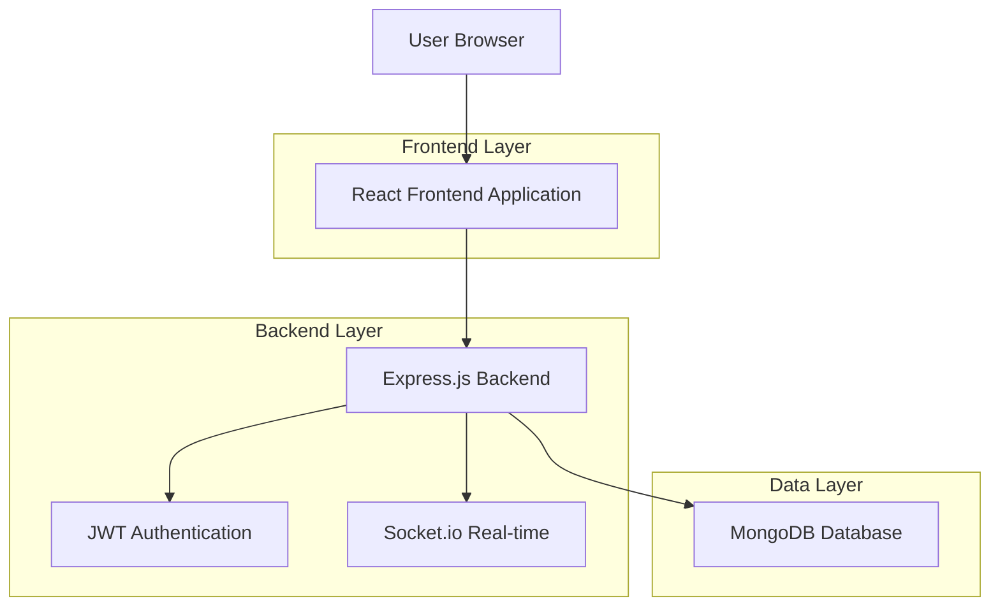
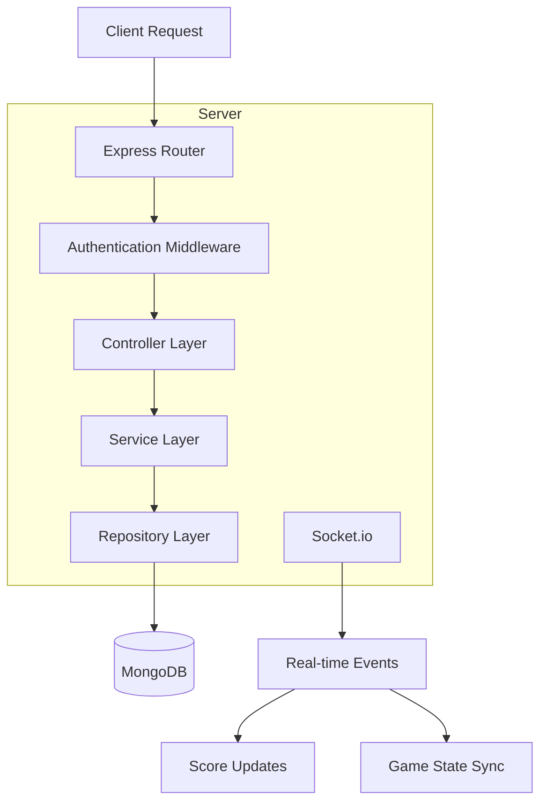
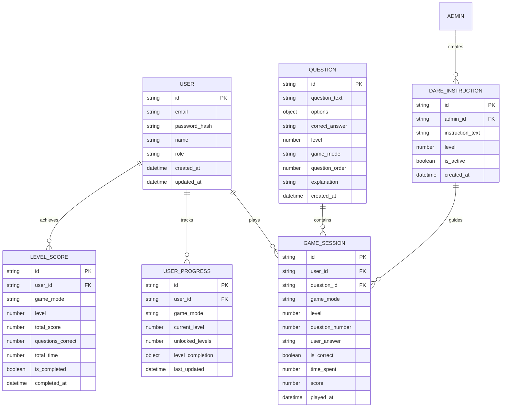

# Elphyta - Technical Architecture Document

## 1. Architecture Design



## 2. Technology Description

- Frontend: React@18 + TypeScript + Tailwind CSS + Vite + Framer Motion
- Backend: Express.js@4 + TypeScript + Socket.io + JWT
- Database: MongoDB (Cloud Atlas)
- Authentication: JWT + bcrypt
- Real-time: Socket.io for live score updates

## 3. Route Definitions

| Route | Purpose |
|-------|---------|
| / | Homepage dengan ELcard dan Tutorial cards |
| /login | Halaman login pengguna |
| /register | Halaman registrasi pengguna baru |
| /tutorial | Halaman tutorial cara bermain dan contoh soal |
| /game-mode | Halaman pemilihan mode Truth atau Dare |
| /level-selection/:mode | Halaman pemilihan level 1-5 untuk mode tertentu |
| /game/truth/:level | Halaman permainan Truth mode untuk level tertentu |
| /game/dare/:level | Halaman permainan Dare mode untuk level tertentu |
| /level-complete/:mode/:level | Halaman hasil penyelesaian level |
| /dashboard | Dashboard skor dan statistik pemain per level |
| /admin | Panel admin untuk manajemen soal dan analitik |
| /admin/questions/:level | Manajemen bank soal teorema Pythagoras per level |
| /admin/dare-instructions/:level | Manajemen instruksi Dare mode per level |
| /admin/analytics | Analitik performa pemain per level |

## 4. API Definitions

### 4.1 Core API

**User Authentication**
```
POST /api/auth/register
```

Request:
| Param Name | Param Type | isRequired | Description |
|------------|------------|------------|-------------|
| email | string | true | Email pengguna |
| password | string | true | Password (akan di-hash) |
| name | string | true | Nama lengkap pengguna |
| role | string | false | Role pengguna (default: 'player') |

Response:
| Param Name | Param Type | Description |
|------------|------------|-------------|
| success | boolean | Status registrasi |
| token | string | JWT token untuk autentikasi |
| user | object | Data pengguna (tanpa password) |

```
POST /api/auth/login
```

Request:
| Param Name | Param Type | isRequired | Description |
|------------|------------|------------|-------------|
| email | string | true | Email pengguna |
| password | string | true | Password pengguna |

Response:
| Param Name | Param Type | Description |
|------------|------------|-------------|
| success | boolean | Status login |
| token | string | JWT token |
| user | object | Data pengguna |

**Game Management**
```
GET /api/questions/level/:level/:mode
```

Response:
| Param Name | Param Type | Description |
|------------|------------|-------------|
| questions | array | Array 5 soal teorema Pythagoras untuk level tertentu |
| level | number | Level kesulitan (1-5) |
| mode | string | Mode permainan (truth/dare) |
| totalQuestions | number | Total soal dalam level (selalu 5) |

```
POST /api/game/submit-answer
```

Request:
| Param Name | Param Type | isRequired | Description |
|------------|------------|------------|-------------|
| questionId | string | true | ID soal yang dijawab |
| answer | string | true | Jawaban yang dipilih (A/B/C/D) |
| timeSpent | number | true | Waktu penyelesaian dalam detik |
| gameMode | string | true | Mode permainan (truth/dare) |
| level | number | true | Level kesulitan (1-5) |
| questionNumber | number | true | Nomor soal dalam level (1-5) |

Response:
| Param Name | Param Type | Description |
|------------|------------|-------------|
| correct | boolean | Status jawaban benar/salah |
| score | number | Skor yang diperoleh |
| explanation | string | Penjelasan jawaban |
| isLevelComplete | boolean | Apakah level sudah selesai |
| nextLevelUnlocked | boolean | Apakah level berikutnya terbuka |

```
GET /api/game/progress/:userId
```

Response:
| Param Name | Param Type | Description |
|------------|------------|-------------|
| truthProgress | object | Progress Truth mode per level (1-5) |
| dareProgress | object | Progress Dare mode per level (1-5) |
| unlockedLevels | object | Level yang sudah terbuka per mode |
| currentLevel | object | Level yang sedang dimainkan per mode |

**Score & Analytics**
```
GET /api/scores/leaderboard
```

Response:
| Param Name | Param Type | Description |
|------------|------------|-------------|
| leaderboard | array | Daftar pemain dengan skor tertinggi |
| userRank | number | Ranking pengguna saat ini |

```
GET /api/scores/user/:userId
```

Response:
| Param Name | Param Type | Description |
|------------|------------|-------------|
| totalGames | number | Total permainan yang dimainkan |
| bestScore | number | Skor terbaik |
| averageTime | number | Rata-rata waktu penyelesaian |
| gameHistory | array | Riwayat permainan |

## 5. Server Architecture Diagram



## 6. Data Model

### 6.1 Data Model Definition



### 6.2 Data Definition Language

**Users Collection**
```javascript
// MongoDB Collection: users
{
  _id: ObjectId,
  email: { type: String, required: true, unique: true },
  password_hash: { type: String, required: true },
  name: { type: String, required: true },
  role: { type: String, enum: ['player', 'admin'], default: 'player' },
  created_at: { type: Date, default: Date.now },
  updated_at: { type: Date, default: Date.now }
}

// Index
db.users.createIndex({ email: 1 }, { unique: true })
db.users.createIndex({ role: 1 })
```

**Questions Collection**
```javascript
// MongoDB Collection: questions
{
  _id: ObjectId,
  question_text: { type: String, required: true },
  options: {
    A: { type: String, required: true },
    B: { type: String, required: true },
    C: { type: String, required: true },
    D: { type: String, required: true }
  },
  correct_answer: { type: String, enum: ['A', 'B', 'C', 'D'], required: true },
  level: { type: Number, min: 1, max: 5, required: true },
  game_mode: { type: String, enum: ['truth', 'dare'], required: true },
  question_order: { type: Number, min: 1, max: 5, required: true },
  explanation: { type: String, required: true },
  created_at: { type: Date, default: Date.now }
}

// Index
db.questions.createIndex({ level: 1, game_mode: 1, question_order: 1 })
db.questions.createIndex({ game_mode: 1, level: 1 })
db.questions.createIndex({ created_at: -1 })
```

**Game Sessions Collection**
```javascript
// MongoDB Collection: game_sessions
{
  _id: ObjectId,
  user_id: { type: ObjectId, ref: 'users', required: true },
  question_id: { type: ObjectId, ref: 'questions', required: true },
  game_mode: { type: String, enum: ['truth', 'dare'], required: true },
  level: { type: Number, min: 1, max: 5, required: true },
  question_number: { type: Number, min: 1, max: 5, required: true },
  user_answer: { type: String, enum: ['A', 'B', 'C', 'D'], required: true },
  is_correct: { type: Boolean, required: true },
  time_spent: { type: Number, required: true }, // in seconds
  score: { type: Number, required: true },
  played_at: { type: Date, default: Date.now }
}

// Index
db.game_sessions.createIndex({ user_id: 1, level: 1, game_mode: 1 })
db.game_sessions.createIndex({ user_id: 1, played_at: -1 })
db.game_sessions.createIndex({ game_mode: 1, level: 1 })
db.game_sessions.createIndex({ score: -1 })
```

**User Progress Collection**
```javascript
// MongoDB Collection: user_progress
{
  _id: ObjectId,
  user_id: { type: ObjectId, ref: 'users', required: true },
  game_mode: { type: String, enum: ['truth', 'dare'], required: true },
  current_level: { type: Number, min: 1, max: 5, default: 1 },
  unlocked_levels: { type: Number, min: 1, max: 5, default: 1 },
  level_completion: {
    level_1: { type: Boolean, default: false },
    level_2: { type: Boolean, default: false },
    level_3: { type: Boolean, default: false },
    level_4: { type: Boolean, default: false },
    level_5: { type: Boolean, default: false }
  },
  last_updated: { type: Date, default: Date.now }
}

// Index
db.user_progress.createIndex({ user_id: 1, game_mode: 1 }, { unique: true })
db.user_progress.createIndex({ user_id: 1 })
```

**Level Score Collection**
```javascript
// MongoDB Collection: level_scores
{
  _id: ObjectId,
  user_id: { type: ObjectId, ref: 'users', required: true },
  game_mode: { type: String, enum: ['truth', 'dare'], required: true },
  level: { type: Number, min: 1, max: 5, required: true },
  total_score: { type: Number, default: 0 },
  questions_correct: { type: Number, min: 0, max: 5, default: 0 },
  total_time: { type: Number, default: 0 }, // in seconds
  is_completed: { type: Boolean, default: false },
  completed_at: { type: Date },
  attempts: { type: Number, default: 0 }
}

// Index
db.level_scores.createIndex({ user_id: 1, game_mode: 1, level: 1 }, { unique: true })
db.level_scores.createIndex({ total_score: -1 })
db.level_scores.createIndex({ game_mode: 1, level: 1, total_score: -1 })
```

**Dare Instructions Collection**
```javascript
// MongoDB Collection: dare_instructions
{
  _id: ObjectId,
  admin_id: { type: ObjectId, ref: 'users', required: true },
  instruction_text: { type: String, required: true },
  level: { type: Number, min: 1, max: 5, required: true },
  is_active: { type: Boolean, default: true },
  created_at: { type: Date, default: Date.now }
}

// Index
db.dare_instructions.createIndex({ admin_id: 1 })
db.dare_instructions.createIndex({ is_active: 1, level: 1 })
db.dare_instructions.createIndex({ level: 1 })
db.dare_instructions.createIndex({ created_at: -1 })
```

**Initial Data**
```javascript
// Sample Questions - Truth Mode Level 1
db.questions.insertMany([
  {
    question_text: "Sebuah segitiga siku-siku memiliki sisi a = 3 cm dan b = 4 cm. Berapa panjang sisi c?",
    options: {
      A: "5 cm",
      B: "6 cm", 
      C: "7 cm",
      D: "8 cm"
    },
    correct_answer: "A",
    level: 1,
    game_mode: "truth",
    question_order: 1,
    explanation: "Menggunakan teorema Pythagoras: c² = a² + b² = 3² + 4² = 9 + 16 = 25, maka c = 5 cm"
  },
  {
    question_text: "Jika sisi miring segitiga siku-siku adalah 13 cm dan salah satu sisi tegaknya 5 cm, berapa panjang sisi tegak lainnya?",
    options: {
      A: "10 cm",
      B: "11 cm",
      C: "12 cm", 
      D: "14 cm"
    },
    correct_answer: "C",
    level: 1,
    game_mode: "truth",
    question_order: 2,
    explanation: "Menggunakan teorema Pythagoras: a² + b² = c², maka b² = c² - a² = 13² - 5² = 169 - 25 = 144, sehingga b = 12 cm"
  },
  // ... 3 soal lainnya untuk Truth Level 1
  
  // Sample Questions - Dare Mode Level 1
  {
    question_text: "Sebuah tangga sepanjang 10 meter disandarkan ke dinding. Jika jarak kaki tangga ke dinding 6 meter, berapa tinggi dinding yang dapat dicapai tangga?",
    options: {
      A: "6 meter",
      B: "7 meter",
      C: "8 meter",
      D: "9 meter"
    },
    correct_answer: "C",
    level: 1,
    game_mode: "dare",
    question_order: 1,
    explanation: "Menggunakan teorema Pythagoras: tinggi² = tangga² - jarak² = 10² - 6² = 100 - 36 = 64, maka tinggi = 8 meter"
  }
  // ... soal lainnya untuk berbagai level dan mode
]);

// Sample Dare Instructions
db.dare_instructions.insertMany([
  {
    admin_id: ObjectId("admin_id_here"),
    instruction_text: "Sebelum menjawab, lakukan 5 jumping jacks!",
    level: 1,
    is_active: true
  },
  {
    admin_id: ObjectId("admin_id_here"),
    instruction_text: "Jawab sambil berdiri dengan satu kaki!",
    level: 2,
    is_active: true
  }
]);

// Sample Admin User
db.users.insertOne({
  email: "admin@elphyta.com",
  password_hash: "$2b$10$hashed_password_here",
  name: "Game Master",
  role: "admin"
});

// Initialize User Progress for new players
function initializeUserProgress(userId) {
  db.user_progress.insertMany([
    {
      user_id: userId,
      game_mode: "truth",
      current_level: 1,
      unlocked_levels: 1,
      level_completion: {
        level_1: false,
        level_2: false,
        level_3: false,
        level_4: false,
        level_5: false
      }
    },
    {
      user_id: userId,
      game_mode: "dare",
      current_level: 1,
      unlocked_levels: 1,
      level_completion: {
        level_1: false,
        level_2: false,
        level_3: false,
        level_4: false,
        level_5: false
      }
    }
  ]);
}
```